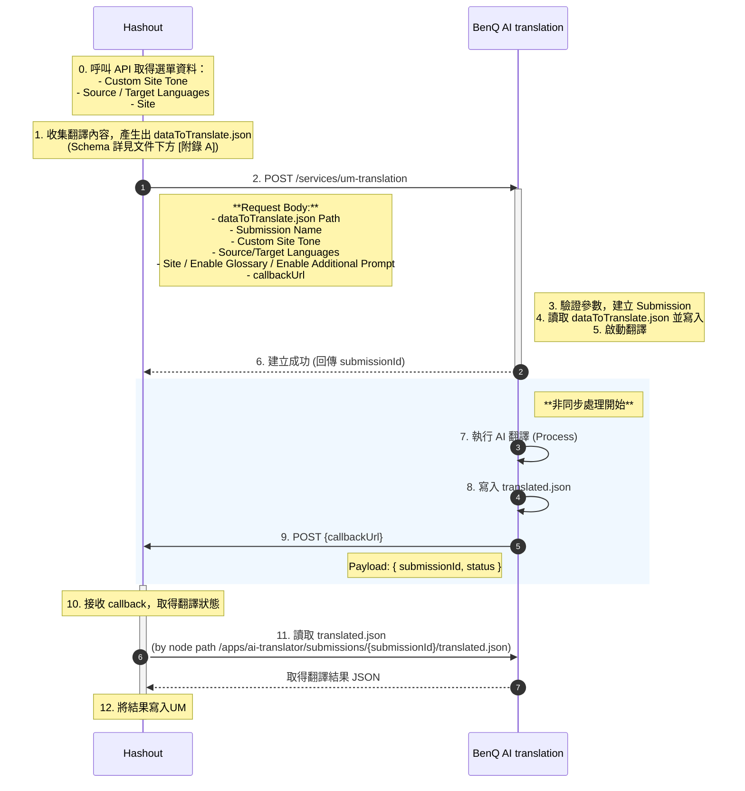

### 附錄 A：dataToTranslate.json 資料格式說明

此 JSON 檔案為翻譯請求的核心 Payload，負責定義需要翻譯的內容區塊及其屬性。

- **格式**：JSON Object
- **層級說明**：
    - **Key (第一層)**：內容節點路徑 (Content Node Path)。這通常是 AEM Content的絕對路徑，作為該內容區塊的唯一識別碼 (Unique Identifier)。
    - **Value (第一層)**：該節點下需要翻譯的屬性物件 (Property Object)。
    - **Key (第二層)**：Property name (如 `title`, `description`, `text`, `button`)。
    - **Value (第二層)**：待翻譯的原始字串。

#### ⚠️ 注意事項
1.  **HTML 標籤**：欄位內容可能包含 HTML 標籤（如 `<a>`, `<span>`, `<p>`）。翻譯系統會保留這些標籤結構，僅翻譯文字內容。
2.  **特殊字元**：內容包含換行符號 `\n`、`\r` 或引號，需符合標準 JSON 跳脫字元規範。

#### JSON 範例 (Example Payload)

```json
{
  "/content/newb2b/id-id/projector/lh750/jcr:content/root/responsivegrid/contentcontainer_203/containerPar/text_copy_copy": {
    "text": "<p style=\"text-align: center;\"><u><span class=\"text-18\"><a href=\"[https://www.benq.com/en-us/business/resource/trends/understand-hk-effect-and-perceived-brightness.html](https://www.benq.com/en-us/business/resource/trends/understand-hk-effect-and-perceived-brightness.html)\" target=\"_blank\">What is the H-K Effect?</a></span></u></p>\n"
  },
  "/content/b2c/demo/monitor/gaming/ex2710r/jcr:content/root/responsivegrid/g6_text_copy_copy": {
    "button": "Learn How",
    "description": "Everything you need for superb sound reproduction is contained in this monitor. The built-in speakers and the five immersive sound modes designed just for gamers delivers a surround sound experience. Plug it in, turn it on and listen, nothing more to do. It’s a much higher-quality alternative to headphones and avoids the hassle of having to connect external speakers.\r\n\r\n",
    "title": "Enchanting Sound Performance With Nothing to Plug In"
  },
  "/content/b2c/demo/monitor/gaming/ex2710r/jcr:content/root/responsivegrid/g6_item_list_5175745/equalWidthItems/item1": {
    "description": "1440p / 16:9 / 120Hz",
    "title": "Xbox Series S"
  },
  "/content/b2c/demo/monitor/gaming/ex2710r/jcr:content/root/responsivegrid/g6_item_list_308435975/equalWidthItems/item1": {
    "description": "-5˚ ~ 15˚",
    "title": "Tilt"
  },
  "/content/b2c/demo/monitor/gaming/ex2710r/jcr:content/root/responsivegrid/g6_item_list_1585659655/equalWidthItems/item1": {
    "description": "Flicker-Free™ eliminates screen flicker during extended viewing. TÜV Rheinland has certified the EX2710R Flicker-free™.",
    "title": "Flicker-Free™"
  }
}