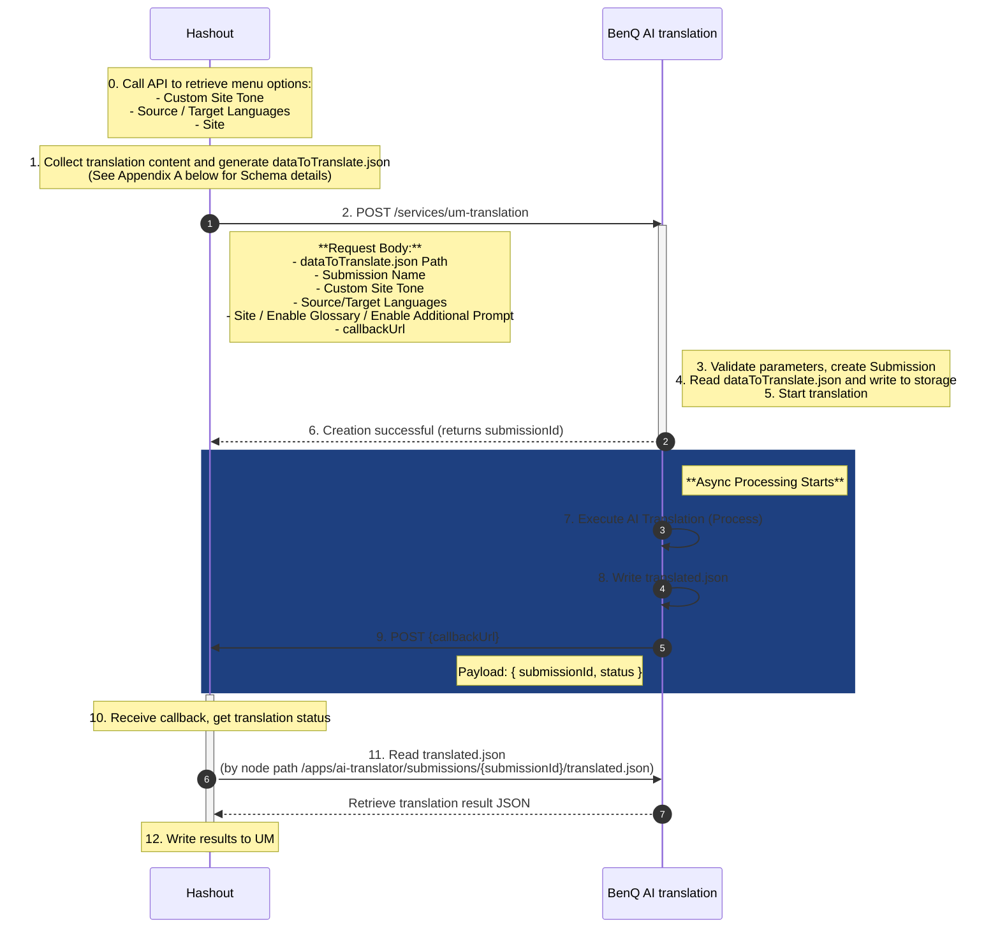

### Integration Workflow


### Appendix A: dataToTranslate.json Data Format Specification

This JSON file serves as the core payload for translation requests, defining the content blocks and attributes that require translation.

- **Format**：JSON Object
- **Hierarchy Description**：
    - **Key (First Level)**：Content Node Path. This is typically the absolute path of the AEM content, serving as the Unique Identifier for that specific content block.
    - **Value (First Level)**：Property Object that contains the attributes requiring translation under that node.
    - **Key (Second Level)**：Property name (e.g., `title`, `description`, `text`, `button`).
    - **Value (Second Level)**：Original string to be translated.

#### ⚠️ Important Notes
1.  **HTML Tags**：1.  **HTML Tags**：Field content may contain HTML tags (e.g., <a>, <span>, <p>). The translation system will preserve these tag structures and only translate the text content.
2.  **Special Characters**：Content may include newline characters `\n`, `\r` or quotes, which must comply with standard JSON escape character specifications.

#### JSON Example (Example Payload)

```json
{
  "/content/newb2b/id-id/projector/lh750/jcr:content/root/responsivegrid/contentcontainer_203/containerPar/text_copy_copy": {
    "text": "<p style=\"text-align: center;\"><u><span class=\"text-18\"><a href=\"[https://www.benq.com/en-us/business/resource/trends/understand-hk-effect-and-perceived-brightness.html](https://www.benq.com/en-us/business/resource/trends/understand-hk-effect-and-perceived-brightness.html)\" target=\"_blank\">What is the H-K Effect?</a></span></u></p>\n"
  },
  "/content/b2c/demo/monitor/gaming/ex2710r/jcr:content/root/responsivegrid/g6_text_copy_copy": {
    "button": "Learn How",
    "description": "Everything you need for superb sound reproduction is contained in this monitor. The built-in speakers and the five immersive sound modes designed just for gamers delivers a surround sound experience. Plug it in, turn it on and listen, nothing more to do. It’s a much higher-quality alternative to headphones and avoids the hassle of having to connect external speakers.\r\n\r\n",
    "title": "Enchanting Sound Performance With Nothing to Plug In"
  },
  "/content/b2c/demo/monitor/gaming/ex2710r/jcr:content/root/responsivegrid/g6_item_list_5175745/equalWidthItems/item1": {
    "description": "1440p / 16:9 / 120Hz",
    "title": "Xbox Series S"
  },
  "/content/b2c/demo/monitor/gaming/ex2710r/jcr:content/root/responsivegrid/g6_item_list_308435975/equalWidthItems/item1": {
    "description": "-5˚ ~ 15˚",
    "title": "Tilt"
  },
  "/content/b2c/demo/monitor/gaming/ex2710r/jcr:content/root/responsivegrid/g6_item_list_1585659655/equalWidthItems/item1": {
    "description": "Flicker-Free™ eliminates screen flicker during extended viewing. TÜV Rheinland has certified the EX2710R Flicker-free™.",
    "title": "Flicker-Free™"
  }
}


